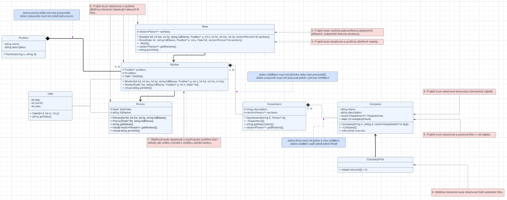
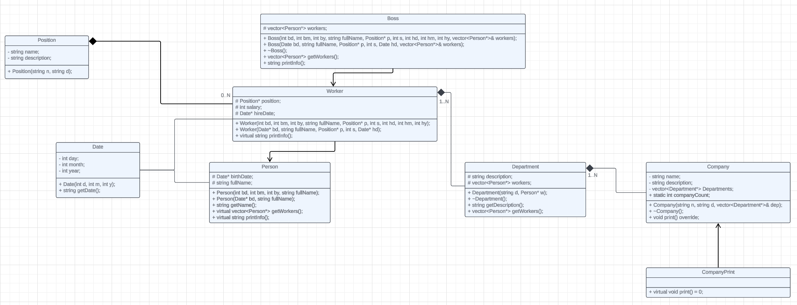

# Systém Řízení Společnosti

Tento projekt implementuje jednoduchý systém řízení společnosti v jazyce C++. Obsahuje třídy pro reprezentaci zaměstnanců, pozic, oddělení a firem.

Odvíjí se od [https://github.com/PlesnikJakub/vsb-oop-2024/tree/main?tab=readme-ov-file](Zadíní) Předmětu OOP.

## Použití

Projekt můžete díky Makefilu zkompilovat a spustit na vašem počítači pomocí

```
make && ./main
```

## Struktura Projektu

- `Company.h` a `Company.cpp`: Definují třídy pro
  - Datum
  - Pozici
  - Osobu
  - Pracovníka
  - Vedoucího
  - Oddělení
  - Firmu.
- `main.cpp`: Obsahuje hlavní funkci pro demonstrování funkcionalit systému řízení společnosti.

## Třídy

### Date

Reprezentuje datum s dnem, měsícem a rokem.

### Position

Reprezentuje pozici ve společnosti s názvem a popisem.

### Person

Reprezentuje osobu s datem narození a plným jménem.

### Worker

Reprezentuje zaměstnance s dodatečnými atributy jako pozice, plat a datum nástupu.

### Boss

Reprezentuje vedoucího, dědícího z Pracovníka, s dodatečným atributem pro řízení zaměstnanců.

### Department

Reprezentuje oddělení s popisem a vedoucím.

### Company

Reprezentuje firmu s názvem, popisem a odděleními.

## UML Třídní Diagram

#### Níže je UML diagram tříd který blíže popisuje vztahy mezi třídami v projektu.



##### Diagram bez popisků


